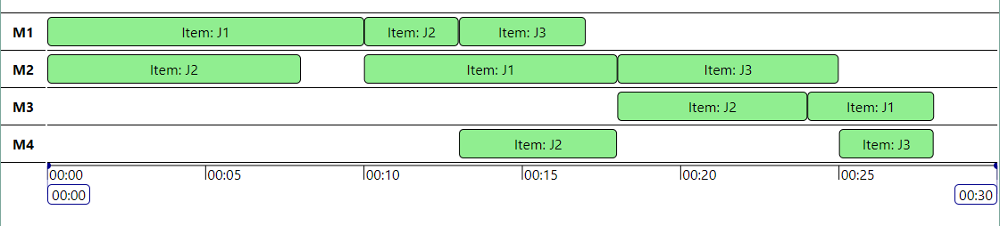

# @michaelyin/timeline

[![Travis][build-badge]][build]
[![npm package][npm-badge]][npm]
[![Coveralls][coveralls-badge]][coveralls]

A React component that shows some events' time and duration on a time scale.

## The Display

* Displays items according to their start and end time.
* Displays items in groups.
* Items with overlapping intervals will display in a stack.
* User can use mouse to pan along the timeline.
* User can scroll in and out to change time scale.

[build-badge]: https://img.shields.io/travis/user/repo/master.png?style=flat-square
[build]: https://travis-ci.org/user/repo

[npm-badge]: https://img.shields.io/npm/v/npm-package.png?style=flat-square
[npm]: https://www.npmjs.org/package/npm-package

[coveralls-badge]: https://img.shields.io/coveralls/user/repo/master.png?style=flat-square
[coveralls]: https://coveralls.io/github/user/repo
