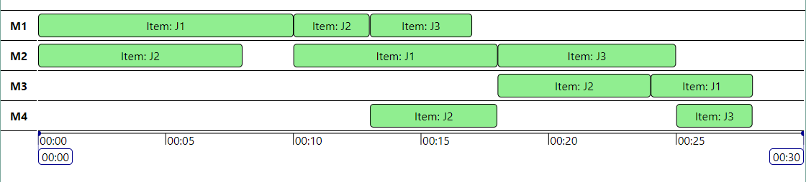

# @michaelyin/timeline

[![Travis][build-badge]][build]
[![npm package][npm-badge]][npm]
[![Coveralls][coveralls-badge]][coveralls]

A React component that shows some events' time and duration on a time scale.

Visit the  [Live Demo](http://<Todo>.com).



## The Display
- Displays items according to their start and end time.
- Displays items in groups.
- Items with overlapping intervals will display in a stack.
- User can use mouse to pan along the timeline.
- User can scroll in and out to change time scale.

## Demos
### Live Demo: [Live Demo](http://<Todo>.com)
### Todo Code Sandbox: [Code Sandbox](http://<Todo>.com)
### Local Demo
```
git clone https://<todo>.git
cd <todo>
npm install && npm start
// or
yarn install && yarn start
```

## Installation
```
npm i michaelyin-timeline-v1.0.1.tgz
// OR
yarn add michaelyin-timeline-v1.0.1.tgz
```

## Usage
```
import {
  Timeline,
  GroupAxis,
  TimelineContent,
  ScheduleContainer,
  TimeAxis
} from '@michaelyin/timeline';
...
const MyComponent = () => {
  return (
    <Timeline
      timeOptions={timeOptions}
      groups={groups}
      items={items}
    >
      <TimelineContent>
        <GroupAxis />
        <ScheduleContainer focusToZoom />
      </TimelineContent>
      <TimeAxis />
    </Timeline>
  );
}
```
Use the timeline component and its children components as above.
The timeline will be rendered with the groups and items.

### Timeline Props
- `timeOptions` an object of
    ```javascript
    {
      minTime,           // javascript Date
      maxTime,           // javascript Date
      viewStartTime,     // javascript Date
      viewEndTime,       // javascript Date
      minViewDuration,   // milliseconds
      maxViewDuration,   // milliseconds
    }
    ```
- `groups` an **array** of object of
    ```javascript
    {
      id,            // unique identifier
      title,         // displayed on the group axis on the left
      description,   // tooltip of the group axis
    }
    ```
- `items` an **array** of object of
    ```javascript
    {
      id,       // unique identifier
      title,    // displayed on the item (optional if you set itemComponent prop)
      groupId,  // id of group
      start,    // javascript Date
      end,      // javascript Date
    }
    ```
- `itemComponent`(Optional) you can pass a custom react component to render the items. The component receives the item's `id` as prop.
- `groupComponent`(Optional) you can pass a custom react component to render the group's area where items are placed. The component receives the group's `id` as prop. *This does not affect the group axis on the left.*

*Note: `timeOptions`, `groups` and `items` pass as props are used only to initialize the timeline. Updates to these props will not take effect, please refer to [Controlled Timeline](wiki/controlled-timeline.md) if you want to update these props.*

*Note: other properties in `timeOptions`, `groups` and `items` objects are ignored.*

### ScheduleContainer Props
- `focusToZoom` By default, when mouse is over the timeline schedule, scrolling will zoom the view time. Set `focusToZoom` to prevent scroll zoom, unless the schedule is selected. Use this if documet scrolling is interrupted by timeline.

### TimeAxis Props
- `focusToZoom` By default, when mouse is over the time-axis, scrolling will zoom the view time. Set `focusToZoom` to prevent scroll zoom, unless the time axis is selected. Use this if documet scrolling is interrupted by timeline.

## Advanced Usage: Controlled Timeline
Other than providing a `Timeline` component as a self-contained component, this library also provides a `ControlledTimeline` to facilitate integration with other parts of an application.
See [Controlled Timeline](wiki/controlled-timeline.md)

## Contributing
see  [CONTRIBUTING](CONTRIBUTING.md)


[build-badge]: https://img.shields.io/travis/user/repo/master.png?style=flat-square
[build]: https://travis-ci.org/user/repo

[npm-badge]: https://img.shields.io/npm/v/npm-package.png?style=flat-square
[npm]: https://www.npmjs.org/package/npm-package

[coveralls-badge]: https://img.shields.io/coveralls/user/repo/master.png?style=flat-square
[coveralls]: https://coveralls.io/github/user/repo
