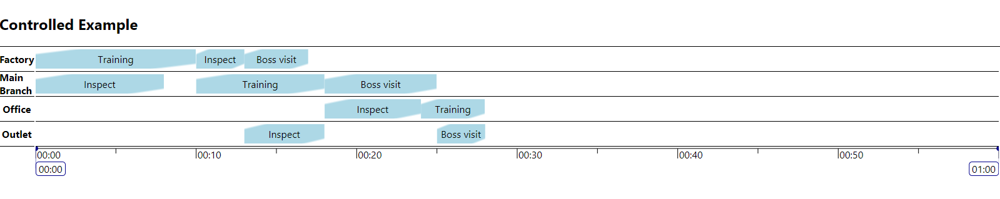

# Custom render of items and groups
The render of items and groups can be changed by setting `itemComponent` and/or `groupComponent` props on `Timeline`/`ControlledTimeline`.



## The ItemComponent prop
Set `itemComponent` to a React component, that receives the timeline item's `id` prop. Other information have to come from the context API. The component will be positioned correctly on the timeline. Its styles can be customized.

### ItemComponent Example
```javascript
const CustomItemComponent = ({ id }) => {
  const items = useContext(CustomContext);
  const item = items.find(e => e.id === id);
  return (
    <div
      style={{
        marginBottom: '4px',
        paddingTop: '5px',
        paddingBottom: '5px',
        display: 'flex',
        alignItems: 'center',
        justifyContent: 'center',
        background: 'linear-gradient(to bottom right, transparent 10%, lightblue 15%, lightblue 85%, transparent 90%)'
      }}
    >
      {item.name}
    </div>
  );
}
```

### In Timeline
```html
<Timeline
  timeOptions={timeOptions}
  groups={groups}
  items={items}
  itemComponent={CustomItemComponent}
>
  <TimelineContent>
    <GroupAxis />
    <ScheduleContainer focusToZoom />
  </TimelineContent>
  <TimeAxis />
</Timeline>
  ```

### In ControlledTimeline
```html
<ControlledTimeline
  itemComponent={CustomItemComponent}
>
  <TimelineContent>
    <GroupAxis />
    <ScheduleContainer focusToZoom />
  </TimelineContent>
  <TimeAxis />
</Timeline>
```

## The GroupComponent prop
Set `groupComponent` to a React component, that receives the timeline groups's `id` prop. The component is rendered on the timeline content area (not on the groupAxis). There would be one `groupComponent` for each group. This prop can be useful for drag-and-drop, setting top/bottom margins or custom background.